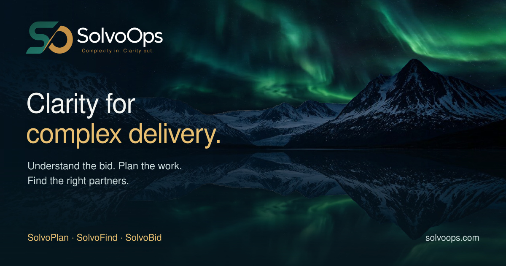

# SolvoOps design context

Approved design baseline: 10 September 2026. Reuse name: **SolvoOps Aurora**.

This is the reusable reference for the design approved in the SolvoOps redesign conversation. Read it before adapting the design to another product. Keep approved decisions here; keep speculative ideas separate. Earlier concepts under `docs/redesign/` are historical where they differ from this baseline.

Reference implementation: [SolvoOps](https://solvoops.com). Reference revision: [`9cfd59a`](https://github.com/th3coke-dot/SolvoOps/tree/9cfd59a36eabcaf73b763222da4d0dc590d38b19), including the refined reflection and sharing artwork. This is a visual baseline, not a claim that every product repository has been updated to it.

## Direction

Cinematic Nordic landscapes, clear typography and restrained glass surfaces. Deep blue and teal provide the foundation; warm gold gives emphasis. Mountains, sky and water create depth and a sense of calm. The interface should feel capable, simple and deliberate.

The owner's priorities are KISS, less is more and mobile-first usability. Every sentence must help someone understand the product, make a decision or complete a task. Remove repeated explanations and decorative interface clutter.

## Identity and names

- Preserve the **original SolvoOps S/O logo**, its proportions, colours and wordmark. Use the supplied artwork; do not redraw or generate a replacement monogram.
- Tagline: **Complexity in. Clarity out.**
- Homepage message: **Clarity for complex delivery.**
- Product family: **SolvoPlan, SolvoFind, SolvoBid**.
- Scope2Plan is the former name of SolvoPlan. PartnerForge is the former name of SolvoFind. Keep necessary technical aliases and redirects, but use current names in visible copy, sign-in screens, logos, favicons, titles and share previews.

## Visual recipe

These values describe the shipped cinematic theme. They are a reuse palette, not a claim that the older global token file has already been consolidated.

| Role | Baseline |
| --- | --- |
| Page background | `#06171d` |
| Deeper footer/background | `#05141a` |
| Raised mobile surface | Gradient from `#183c44f2` to `#071e28f7` |
| Main text | Soft white, approximately `#f0f3ef` |
| Secondary text | `#c6d5d9` |
| Gold emphasis | `#ebc477`; headline variant `#edc77f` |
| Primary button | Gradient `#f1d38e` → `#dfb45f`, dark text `#102126` |
| Supporting teal | `#7fd6d0` |
| Card border | `rgba(126,200,209,.38)` |
| Typography | Source Sans 3, with Segoe UI / sans-serif fallback |

Use light, spacious hero headings (weight 300), ordinary-weight product headings and readable body copy. Highlight one meaningful phrase in gold. Small uppercase labels may use generous letter spacing; body copy should not.

Desktop content width is approximately 1300px, with 56px side gutters where space permits. Phone layouts use approximately 20px gutters and stack naturally. Product cards use roughly 12px corners, fine borders and restrained shadows. Primary actions use rounded gold buttons; secondary actions use a quiet outlined or underlined treatment.

Keep the logo and menu **over the sky**. The header may have a subtle dark-to-transparent gradient for readability; it must not become a separate solid ribbon above the landscape. An opened menu needs a legible solid surface.

## Landscape and motion

The approved sequence is **aurora → day → evening → aurora**, with gentle crossfades over a 72-second cycle. The landscape stays aligned through the sequence. Water moves subtly; it should not appear to slide away from the mountains.

Reuse [BrandScene.tsx](src/components/BrandScene.tsx), [BrandScene.css](src/components/BrandScene.css) and the assets in [public/scene](public/scene). The current scene uses HTML wrappers for opacity/transform animation, not animated turbulence or displacement filters.

Reflection details that must travel with the component:

- Mirror the complete visible landscape, including its sky. Do not overlay another roughly traced sky on top of the photograph's existing reflection.
- Share the same detailed skyline path above and below the water.
- Keep the shoreline mask fixed while the reflection moves inside it.
- The current 1280×720 photograph has its shoreline at source y=401. Its reflection transform is `translate(0 802) scale(1 -1)`. These coordinates belong to this photograph; retrace them if changing the landscape.
- Include [water-mask.svg](public/scene/water-mask.svg). Its sizing must match the scene's cover crop.
- Current water movement is a 7-second alternating transform of less than one CSS pixel. Preserve that restraint.

The S/O symbol makes one subtle 3D turn on arrival: 2.8 seconds after a 0.35-second delay. The wordmark stays still. It does not loop or replay on each client-side route change. Reuse the original artwork and the existing separation of symbol and wordmark in [CinematicNav.tsx](src/components/CinematicNav.tsx).

Respect reduced-motion and save-data preferences. Provide pause/replay when animation is enabled. Pause the scene offscreen and when the browser tab is hidden. Text and actions must work immediately, including when scene assets fail to load. Remove expensive backdrop blur on phones; preserve the surface colour and border instead.

## Pages and product entry

Corporate product pages are **real information pages**. They must not automatically redirect into the tool. Each provides two distinct actions: **Open [product]** to its actual website and **Discuss a pilot** with the relevant product selected.

The tool's own entry/sign-in screen should carry the same family design and the current product name. Style its existing authentication flow; preserve its authentication and access rules.

Apply the family design to secondary pages too: About, How it works, Labs, Pilot, Privacy, Terms, Who Gets the Call, error pages and footer. Legal or text-heavy pages use the quiet reading layout with a calm background. Preserve substantive legal content when simplifying presentation.

Replace isolated arrow circles with clear action labels. An icon may support a label, but the user should not have to infer the action from an arrow. Product examples should be labelled as examples; do not turn illustrative UI into claims of live data or released capability.

## Reusing this for another product

Keep the logo family, typography, dark surfaces, gold action hierarchy, mobile behaviour and quality of imagery consistent. Adapt the headline, examples, navigation, product accent and actions to the actual job of that product.

For working interfaces, carry the colours, typography and component treatment into readable forms, tables and task views. Reserve the cinematic scene for appropriate entry or presentation surfaces; it should not compete with dense operational work. This is adaptation guidance, not a requirement to redesign every workspace as a full-screen landscape.

Start by inspecting the destination repository's current routes, branding, shared components and auth flow. Reuse existing components where possible. Import a coherent scene implementation with its CSS and assets; do not copy isolated effects from obsolete prototypes. Keep a link to this canonical guide and record product-specific decisions locally.

Useful source map:

| Purpose | Reference |
| --- | --- |
| Scene, phases and reflection | [BrandScene.tsx](src/components/BrandScene.tsx), [BrandScene.css](src/components/BrandScene.css) |
| Navigation and original-logo motion | [CinematicNav.tsx](src/components/CinematicNav.tsx) |
| Homepage layout and final cinematic overrides | [HomePage.css](src/pages/HomePage.css) |
| Shared company / quiet page shell | [CinematicPage.tsx](src/components/CinematicPage.tsx), [CinematicCompanyPage.css](src/pages/CinematicCompanyPage.css) |
| Product hero | [ProductHero.tsx](src/components/ProductHero.tsx), [CinematicProductPage.css](src/pages/CinematicProductPage.css) |
| Original logo artwork | [public/brand](public/brand) |
| Product names and content | [products.ts](src/content/products.ts), [cinematic.ts](src/content/cinematic.ts) |
| Social sharing metadata | [index.html](index.html), [site-metadata.ts](src/content/site-metadata.ts), [DocumentMeta.tsx](src/components/DocumentMeta.tsx) |
| Static share-card generator | [generate-share-card.mjs](scripts/generate-share-card.mjs), `npm run artwork:share` |

The share card is a static 1200×630 JPEG using the same scenery, logo and product names. Use a new image filename when publishing a changed card. Include Open Graph and Twitter image tags in server-delivered HTML, not only JavaScript. Previously sent messages may retain their own cached previews.

## Completion check for an adaptation

Review desktop and narrow phone layouts, including a short screen and widths around 320–390px. Confirm legible text, no horizontal overflow, clear focus states and touch targets of at least 44px. Verify menu operation, actual tool links, pilot selection and sign-in actions.

Inspect all lighting phases and transitions, both the mountain outline and its reflection, plus reduced-motion behaviour. Check secondary pages, favicons, titles and sharing images for old branding. Run the destination repository's relevant build and checks, and review its hosted preview before release. Design guidance does not replace that repository's release or data-access boundaries.

## Instruction to reuse

> Apply the SolvoOps Aurora design from `th3coke-dot/SolvoOps/context.md` to this product. Follow its approved identity, colours, typography, motion, mobile behaviour and content principles. Reuse the referenced source assets and components, adapting the product copy and actions to real functionality. Verify the complete affected user flow and share previews. Record any product-specific design decisions without duplicating the canonical guide.
